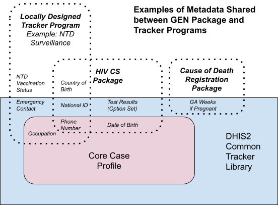

# Common Metadata Library { #common-metadata-library }

## Introduction

This document describes a metadata package that provides a baseline of core DHIS2 metadata for use across multiple Tracker programs. The metadata included are not programme/use case specific, but are generally expected to be shared across tracker programs as part of a harmonized HMIS.

One key advantage of DHIS2 is that it can be used for multiple health programs, within a single, harmonized instance. There are several practical reasons to share metadata across tracker programs:

- To reduce duplication of data entry and improve data flows, e.g. where a person’s details recorded in one program can be carried over to another program;
- To improve analytical capabilities across programs by re-using common metadata and its associated codes for core attributes like Sex;
- To facilitate maintenance of the metadata in the system

DHIS2 metadata packages are designed and harmonized in a way which allows multiple packages to be imported into the same DHIS2 instance. This might be done to link an individual’s enrollments in different programs, or create synergies across reporting flows for different health areas. For example, a patient may be enrolled in both HIV and TB case surveillance programs, but the patient’s Sex is recorded only once at the time of first enrollment. To do this, the programs need to share the same metadata for the tracked entity attribute (Sex) plus its associated option set and options (Male, Female, and Unknown).

Importing those common metadata together as a baseline package ensures that the Unique IDs, names, and codes for objects (e.g. tracked entity attributes, option sets, options, and data elements. In addition, if a custom program is developed within the same instance, it could re-use those metadata from the baseline package, thereby bootstrapping configuration of the new program, preventing namespace clashes and other complications during metadata import/export, and facilitating data exchange across platforms. This becomes particularly important when aligning tracker implementations that may exist across multiple instances into a shared, harmonized environment.

## System Design Overview

Common tracker metadata are made available as installable metadata files that can be imported into a new or existing DHIS2 instance. These installable files contain metadata that are aligned to a few common use cases for DHIS2 Tracker:

1. Core Case Profile

These are used across all WHO case-based surveillance tracker programs: Immunization, HIV, Malaria, TB, VPD, and COVID-19 Case-based surveillance. The Core Case Profile was developed through an internal WHO harmonization of naming conventions for case-based registries and facility-level aggregate datasets across all WHO programmes that use DHIS2 as of September 2020. This library will be reviewed on an annual basis for possible revisions. It includes:

- Tracked Entity Type (Person)
- Tracked Entity Attributes
- Options
- Option Sets

2. DHIS2 Common Tracker Metadata library

Common Tracker Metadata library contains all WHO Core Case Profile objects from above, plus other common metadata such as data elements, option sets, and options. This library is not exhaustive, but contains metadata concepts that are included in official DHIS2 tracker packages, and are generic enough that they could be conceivably shared across programs (e.g. option sets for a list of countries or a data element for ‘date of death’). The library is intended to provide a selection of common metadata that implementers can take at their discretion in the development of tracker programs. This library will be more frequently updated and expanded on a semi-annual basis as metadata packages are developed and deployed.

All metadata in the Common Tracker Metadata Library comprise metadata groups containing the prefix GN (for General. The prefix helps to signify to the implementer or system admin that the metadata object is being shared across programs, and impact across programs should be considered before making changes/adjustments to shared metadata.

- Tracked entity type (Person)
- Tracked entity attributes
- Option sets, including ISO 3166-1 alpha-2 country codes
- Options
- Data elements
- Custom attributes associated with the above (e.g. LOINC, Snomed, ICD-11)

The diagram above illustrates a few points about the modular structure of the package.

The DHIS2 Common Tracker Library includes the entirety of the WHO Core Case Profile, in addition to other metadata objects.

A DHIS2 Metadata Package may utilize metadata found within the Core Case Profile, within the broader Common Tracker Library, or its own program-specific metadata (see HIV CS Package).

A custom, locally-designed tracker program may also utilize metadata found within the Core Case Profile, within the broader Common Tracker Library, or develop its own program-specific metadata.

Imagine a scenario where the NTD Surveillance program above is developed independently. The implementers then decide to import the HIV CS package into the same DHIS2 instance. There would be a number of conflicts during metadata import, because objects in each program have the same name and different UIDs (phone number, national ID, and country of birth). If the Core Case Profile had been imported prior to the configuration of a custom NTD program, there would be less work involved to configure new metadata, and fewer clashes when the HIV CS package is imported.

Finally, note that the GEN prefix will not be visible to end users of your programs. These metadata come translated for XYZ different locales, and can be further translated to other local languages without interfering with the baseline UIDs, names, and codes.
